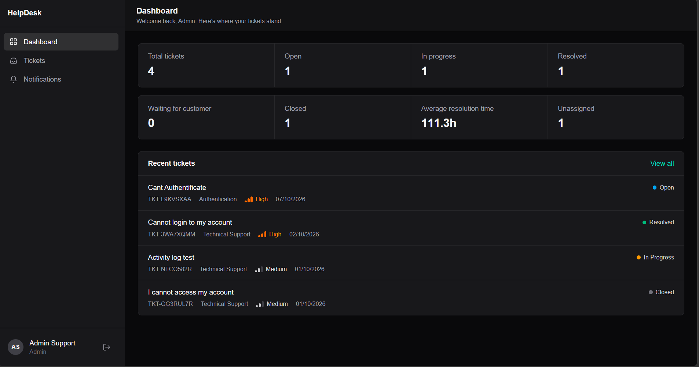
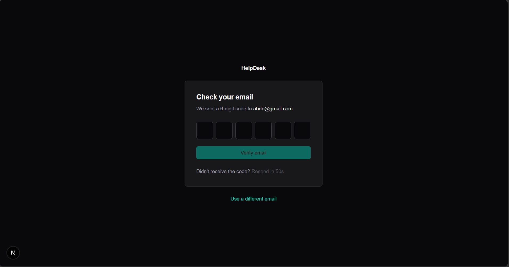
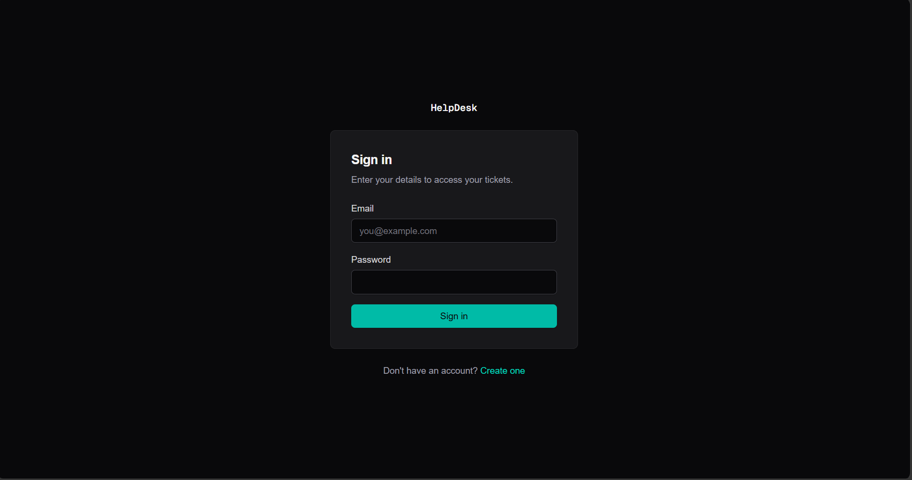
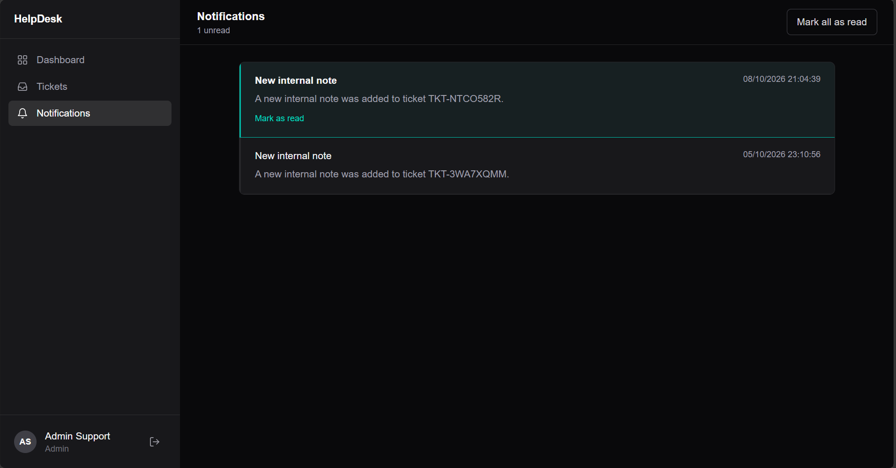
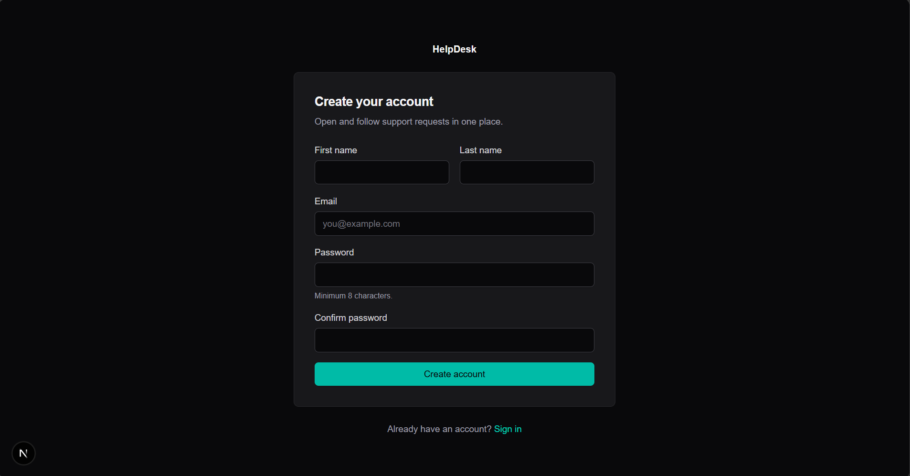
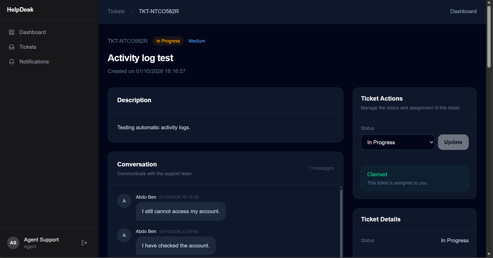
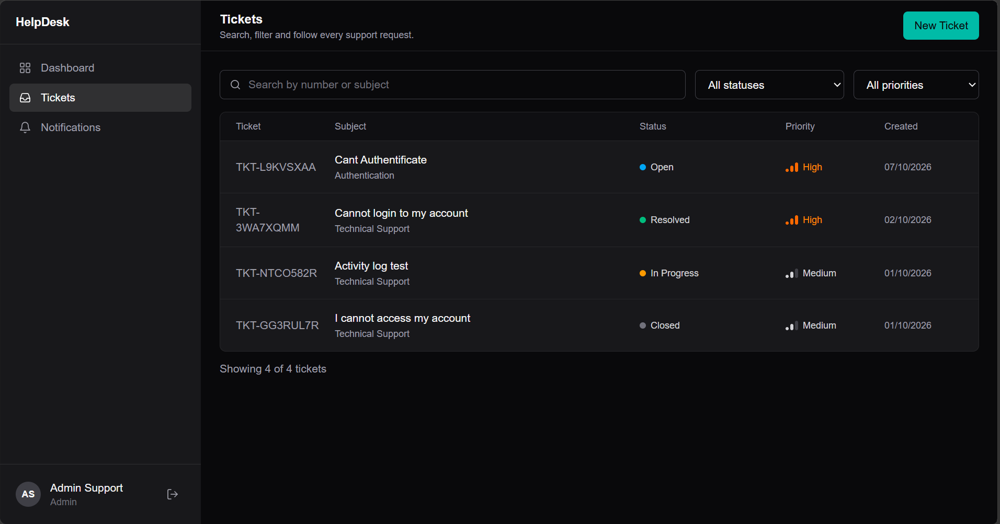
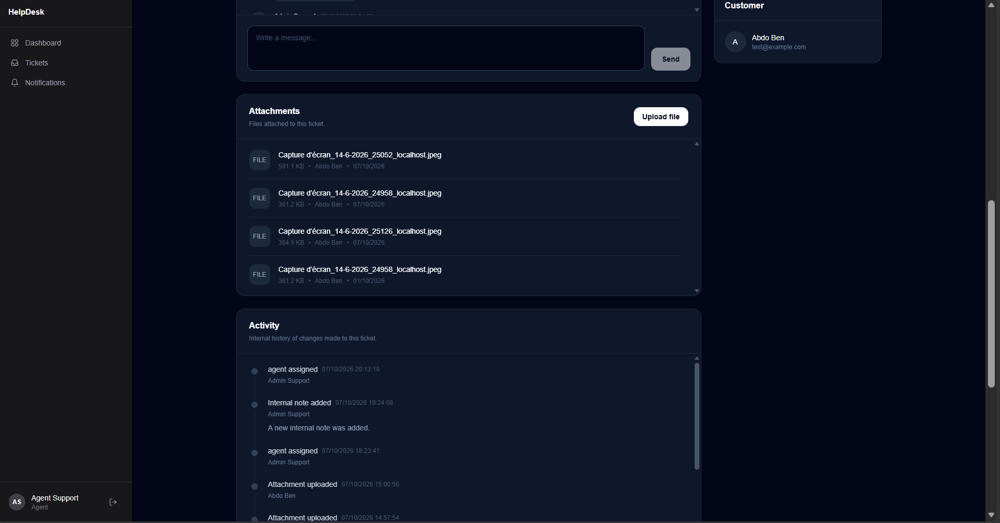
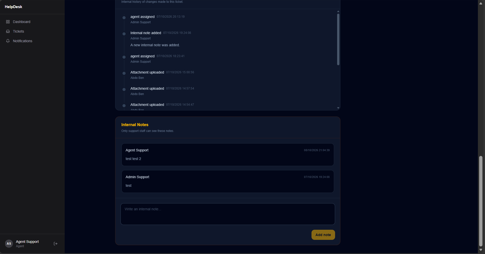

HelpDesk — Customer Support Platform

 <strong>A full-stack customer support platform built with Laravel, Next.js, React, TypeScript, and Tailwind CSS.</strong> 

HelpDesk provides a structured environment for managing customer support requests, assigning tickets to agents, communicating through ticket conversations, tracking support activity, and monitoring operational performance.

The project demonstrates practical full-stack development through REST API integration, authentication and authorization, email verification, ticket workflows, notifications, file attachments, analytics, and automated backend testing.

Screenshots

Screenshots below showcase the actual application. Add the corresponding images to the root screenshots/ directory after capturing them from the running application.

<table>
  <tr>
    <td width="50%" align="center">
      <strong>Dashboard</strong> 
      
    </td>
    <td width="50%" align="center">
      <strong>Email Verification</strong> 
      
    </td>
  </tr>
  <tr>
    <td width="50%" align="center">
      <strong>Login</strong> 
      
    </td>
    <td width="50%" align="center">
      <strong>Notifications</strong> 
      
    </td>
  </tr>
  <tr>
    <td width="50%" align="center">
      <strong>Register</strong> 
      
    </td>
    <td width="50%" align="center">
      <strong>Ticket Details</strong> 
      
    </td>
  </tr>
  <tr>
    <td width="50%" align="center">
      <strong>Tickets</strong> 
      
    </td>
    <td width="50%" align="center">
      <strong>Continuation of the ticket page</strong> 
      
    </td>
    <td width="50%" align="center">
      <strong>Ticket Admin Support Notes</strong> 
      
    </td>
  </tr>
</table>

Key Features
Authentication and Security
User registration and login.
Laravel Sanctum token authentication.
Six-digit email verification using OTP codes.
Verification code expiration and attempt limits.
Verification code resend throttling.
Role-based authorization.
Protected API resources.
Request validation and rate limiting.
Secure attachment handling.
User Roles
Role	Responsibilities
Customer	Create support tickets, communicate with support staff, and track ticket progress.
Agent	Handle assigned tickets, respond to customers, and collaborate through internal notes.
Admin	Manage support operations, assign tickets, and access authorized administrative features.

Actual permissions are enforced by the backend authorization rules.

Ticket Management
Create, view, and update support tickets.
Manage ticket statuses and priorities.
Assign tickets to agents.
Allow agents to claim available tickets.
Manage unassigned tickets.
Reopen tickets when additional support is needed.
Organize tickets by category.
Communication and Collaboration
Customer-agent conversations.
Internal notes for support staff.
File attachments.
Ticket activity logs.
Support workflow tracking.
Notifications
Notification center.
Read and unread notification states.
Unread notification counts.
Mark individual notifications as read.
Dashboard and Analytics

The backend provides analytics endpoints for the following areas:

Dashboard statistics.
Ticket trends.
Agent performance.
Response performance.
Customer statistics.

The metrics displayed in the frontend depend on the data returned by the API and the implemented dashboard components.

Ticket Workflow

A typical support workflow follows this structure:

Customer
   |
   v
Create Ticket
   |
   v
Unassigned Ticket
   |
   +----------------------+
   |                      |
   v                      v
Agent Claims         Admin Assigns
   |                      |
   +----------+-----------+
              |
              v
         In Progress
              |
              v
           Resolved
              |
              v
            Closed

Tickets can also be reopened when additional support is required, subject to the application's existing workflow rules.

Authentication Flow

The application uses email verification as part of its registration process.

Register
   |
   v
Account Registration
   |
   v
Verification Code Sent by Email
   |
   v
Submit Six-Digit OTP
   |
   v
Backend Verification
   |
   v
Authentication Token
   |
   v
Access Authorized Pages

The verification flow includes code expiration, attempt limits, and resend throttling according to the backend implementation.

Technology Stack
Backend
Laravel
PHP
Laravel Sanctum
RESTful API
SQL database
Composer
PHPUnit / Laravel testing tools
SMTP email delivery
Frontend
Next.js App Router
React
TypeScript
Tailwind CSS
Axios
External Services

SMTP email provider for verification emails. The backend documentation describes a Brevo SMTP integration.

Consult the project's dependency files and environment configuration for the exact versions and active services.

Architecture

HelpDesk uses a separated frontend and backend architecture.

+--------------------------------+
|        Next.js Frontend        |
|                                |
| React                          |
| TypeScript                     |
| Tailwind CSS                   |
| Axios API Client               |
+----------------+---------------+
                 |
                 | HTTP / JSON
                 | Authentication Token
                 v
+--------------------------------+
|        Laravel REST API        |
|                                |
| Authentication                 |
| Authorization                  |
| Request Validation             |
| Ticket Workflows               |
| Messages and Attachments       |
| Notifications and Analytics    |
+----------------+---------------+
                 |
                 v
+--------------------------------+
|          SQL Database          |
+--------------------------------+

                 |
                 v
+--------------------------------+
|         SMTP Email Service     |
|       Email Verification       |
+--------------------------------+

The frontend communicates with the Laravel API, while authentication, authorization, validation, and business rules remain enforced by the backend.

Project Structure
helpdesk/
├── README.md
├── screenshots/
│   ├── dashboard.png
│   ├── tickets.png
│   ├── ticket-details.png
│   ├── create-ticket.png
│   ├── login.png
│   └── verify-email.png
├── helpdesk-api/
│   └── README.md
└── helpdesk-front/
    └── README.md

This is a simplified overview. Consult each directory for the complete source structure.

Getting Started
Prerequisites

Install the tools required to run both applications:

PHP and the extensions required by the backend dependencies.
Composer.
A supported SQL database.
Node.js compatible with the frontend's Next.js version.
npm.
An SMTP account if you want to test email delivery.
1. Clone the Repository

Replace the placeholder with the actual repository URL after publishing the project.

git clone <repository-url>
cd helpdesk

2. Configure the Backend

Navigate to the backend directory:

cd helpdesk-api
composer install

Create the environment file by copying .env.example to .env.

On macOS or Linux:

cp .env.example .env

On Windows Command Prompt:

copy .env.example .env

Configure your application, database, and mail settings in .env.

Generate the Laravel application key:

php artisan key:generate

Create the database specified in your environment configuration, then run:

php artisan migrate

Start the API:

php artisan serve

The default local server address is:

http://localhost:8000

The documented API base URL is:

http://localhost:8000/api

For detailed configuration and API documentation, see helpdesk-api/README.md.

3. Configure the Frontend

Open a second terminal and navigate to the frontend directory:

cd helpdesk-front
npm install

Create a .env.local file in the frontend root:

NEXT_PUBLIC_API_URL=http://localhost:8000/api

This variable specifies the API base URL. It is exposed to the browser, so it must never contain private credentials or secrets.

Start the development server:

npm run dev

Open:

http://localhost:3000

For detailed frontend setup and implementation information, see helpdesk-front/README.md.

Testing

The backend README records the following test results from a previous test run:

Metric	Recorded result
Tests	74
Assertions	302
Failures	0

These are previously recorded results, not a guarantee of the current test status.

To run the backend test suite, execute:

cd helpdesk-api
php artisan test

Report updated results only after running the tests against the current codebase.

Security Considerations

Security-related mechanisms documented for the application include:

Laravel Sanctum authentication.
Backend authorization and role checks.
Request validation.
Rate limiting.
Verification code expiration and attempt limits.
Attachment validation and access control.
Protection for restricted ticket resources.

For deployment, configure HTTPS, production environment settings, trusted CORS origins, database credentials, and SMTP credentials appropriately.

Never commit .env, .env.local, API tokens, SMTP passwords, or other secrets to source control.

These documented mechanisms do not replace a formal security audit.

Future Improvements

Potential future enhancements, depending on the current implementation, include:

Expanded automated frontend testing.
More advanced ticket filtering and reporting.
Additional accessibility testing.
Deployment automation and continuous integration.
Further dashboard analytics and reporting improvements.

These are potential enhancements, not claims that the features have already been implemented.

Related Documentation
Backend API Documentation
Frontend Documentation
License

No open-source license is specified in this README.

Add an appropriate LICENSE file if you intend to distribute the project under a specific open-source license. Until then, do not represent the repository as being released under an open-source license.

 HelpDesk — A full-stack customer support platform built to demonstrate practical frontend and backend engineering, API integration, authentication, ticket workflows, and maintainable application architecture. 

